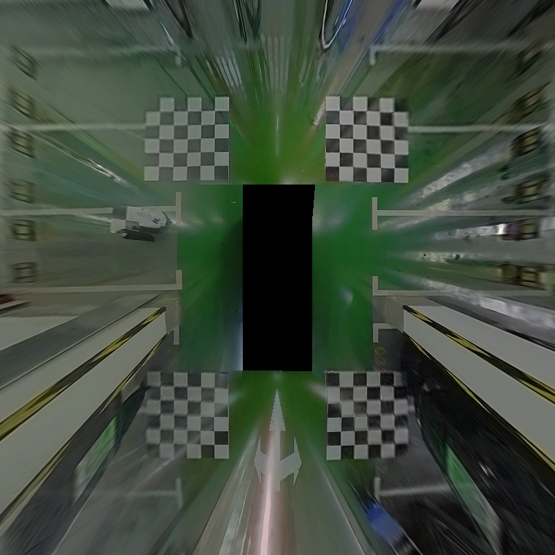

# StitchCuda

## 1 Requirement
This codebase has been developed with cuda-11.1, OpenCV-3.2.0 and YAML ...

## 2 Installation
### 2.1 Install modules *StitchCuda*
```
git clone git@github.com:little-bookworm/StitchCuda.git
cd StitchCuda
bash build.sh
``` 

## 3 Test
### 3.1 Run test
`
bash run_test.sh
`
### 3.2 Results Visualization
<div align=left>

## Reference Repo
|index|repo|info|
|----|----|----|
|1|[surround-view-system-introduction]<https://github.com/neozhaoliang/surround-view-system-introduction>|python verison|
|2|[360-Surround-View-CUDA-Project]<https://github.com/zhangyeyan/360-Surround-View-CUDA-Project>|c++ verison|